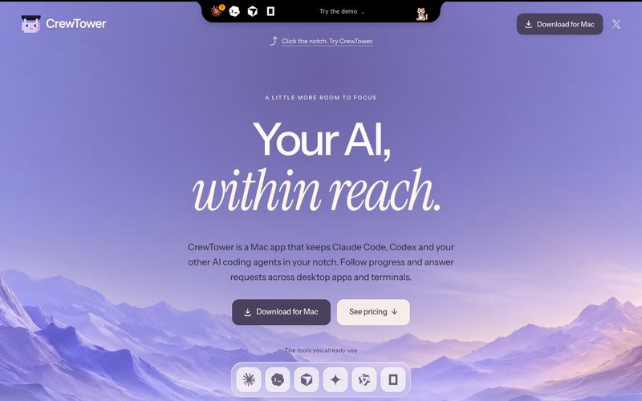
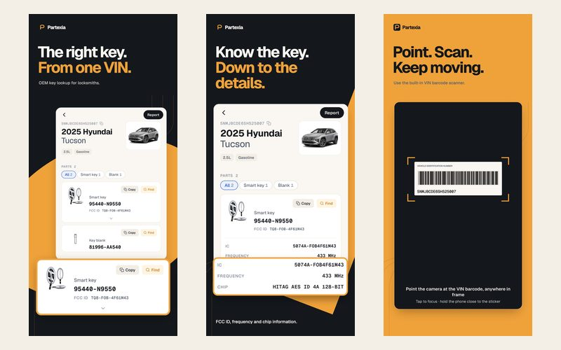
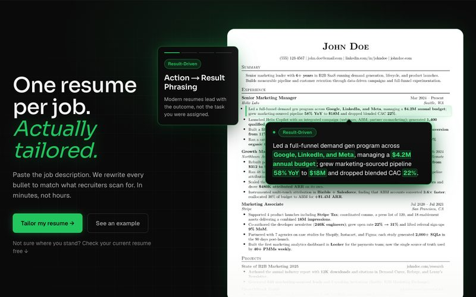

### Hi, I'm Said 👋

I'm a full-stack developer from Canada, and I'll admit it: I'm a bit AI-addicted.
I build with Claude Code, Codex and a handful of agents every day, and they're the reason I can take a product from idea to real users on my own.
What I care about hasn't changed, though: building things that fix a real problem for someone and seeing them all the way through.
Most of my work is in TypeScript, React and Python, and lately a fair bit of Swift.

[LinkedIn](https://www.linkedin.com/in/altansaid) · [Portfolio](https://saidaltan.com) · [altansaid13@outlook.com](mailto:altansaid13@outlook.com)

### Projects I'm proud of

<table>
  <tr>
    <td width="42%" valign="top"></td>
    <td valign="top">
      <b>CrewTower</b> 
      A Mac app that puts my AI coding agents in the MacBook notch.
      When Claude Code, Codex or another agent needs permission, has a question or finishes, I can answer it or jump straight to the right terminal tab without leaving what I'm doing.
      It's out now as a one-time purchase. 
      <a href="https://crewtower.app">crewtower.app</a> · <a href="https://youtu.be/atLNjf65_vc">Watch the intro video</a>
    </td>
  </tr>
  <tr>
    <td width="42%" valign="top"></td>
    <td valign="top">
      <b>Partexia</b> 
      An iOS app for automotive locksmiths.
      You type or scan a car's VIN and it tells you exactly which OEM key, fob or ignition part fits, instead of digging through dealer catalogs.
      It's live on the App Store and covers 33 vehicle makes so far. 
      <a href="https://apps.apple.com/app/id6792610998">App Store</a> · <a href="https://partexia.com">partexia.com</a>
    </td>
  </tr>
  <tr>
    <td width="42%" valign="top"></td>
    <td valign="top">
      <b>Rolevanta</b> 
      A web app that tailors your resume to each job description, so you don't spend hours rewriting it for every application.
      I built it on my own in about three months, and within two months of launch it was getting around 1,200 visitors a month. 
      <a href="https://rolevanta.com">rolevanta.com</a>
    </td>
  </tr>
</table>

Also: [PLAB 2 Practice](https://plab2practice.com), a real-time platform where doctors practise for the PLAB 2 exam with each other (300+ active users), and [QDock](https://github.com/altansaidp/QDock), a small open-source menu bar app that shows your Claude Code and Codex usage limits.

### Tech stack

- **Frontend:** TypeScript, React, Next.js, Tailwind CSS
- **Mobile and desktop:** React Native, Swift, SwiftUI
- **Backend:** Node.js, Python (FastAPI), Java (Spring Boot), PostgreSQL, Supabase
- **Tooling:** Docker, GitHub Actions, AWS, GCP
